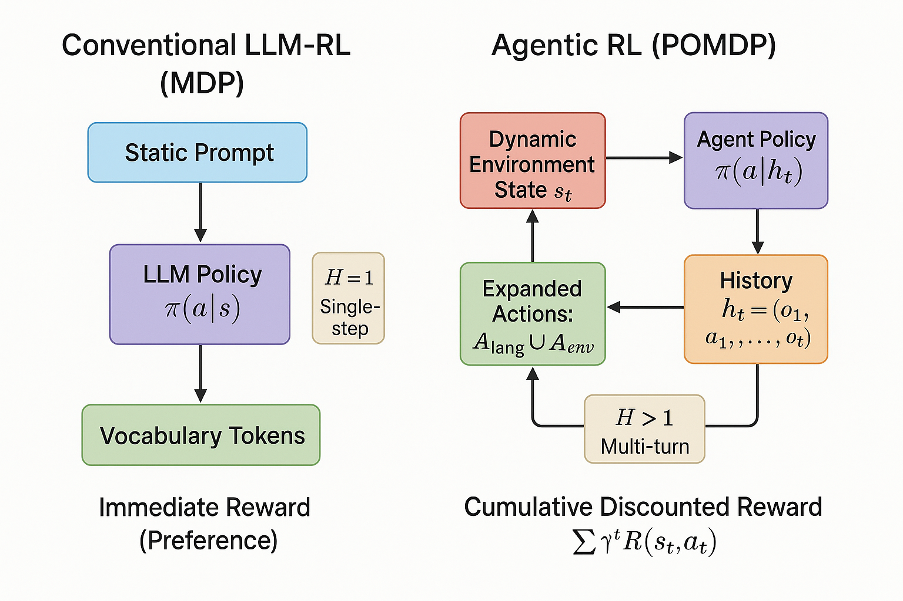
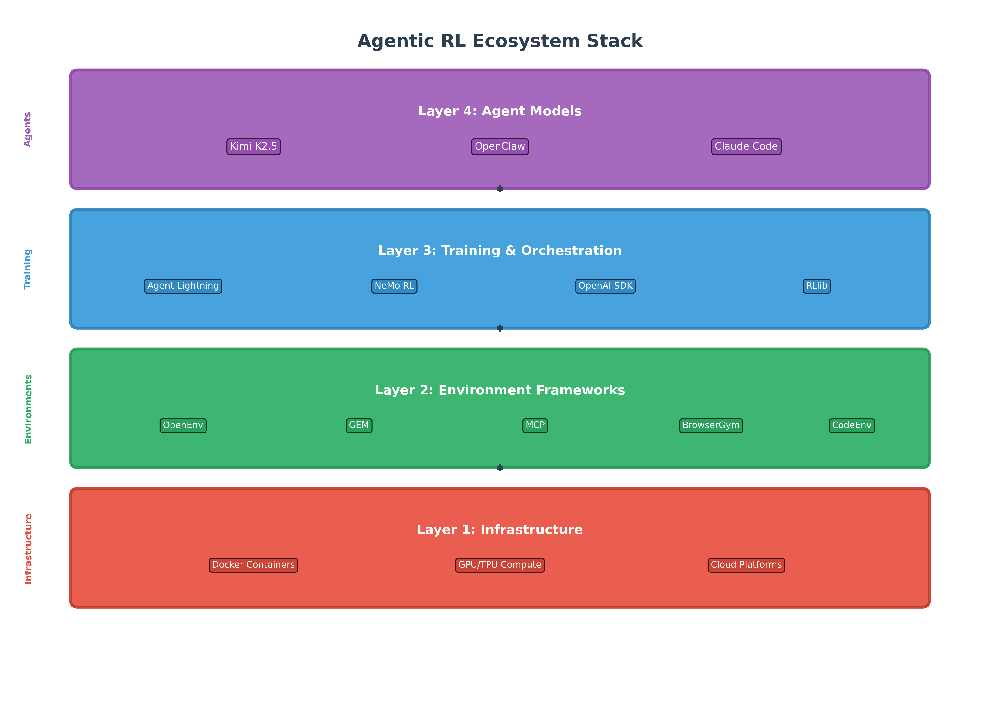
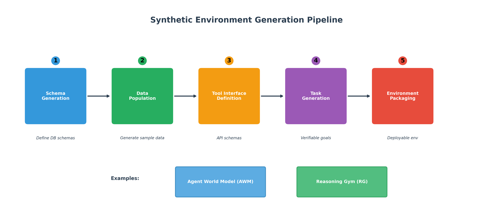
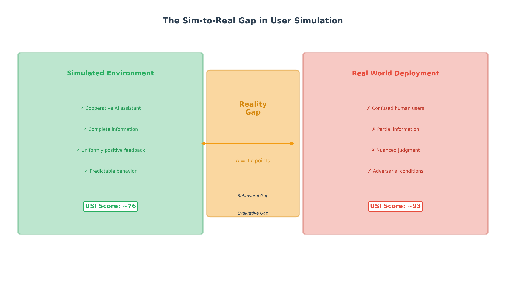

# The Environment Layer: Why Agentic AI Will Be Won by Better Training Environments

Large language models have already become strong at answering questions. The next frontier is getting them to act reliably over time: planning, using tools, interacting with software, recovering from mistakes, and completing real tasks in the messy conditions of production systems.

That shift changes where the bottleneck is.

For the last few years, most of the attention in AI has gone to bigger models, better post-training, and new agent interfaces. Those matter. But if the goal is robust agentic behavior, the decisive layer is increasingly the environment in which the model learns. Agents do not become dependable by model quality alone. They become dependable by training in environments that expose the right tasks, the right constraints, and the right reward signals.

That is the core argument of our paper: **the environment layer is the missing infrastructure for agentic AI training**.

## Executive Summary

- The move from chatbots to agents is a move from single-turn prediction to long-horizon decision-making.
- That shift requires a new training setup: dynamic environments, tool interfaces, persistent state, and verifiable rewards.
- Environment frameworks such as OpenEnv, GEM, and MCP are becoming the infrastructure layer for agent development.
- Synthetic environment generation, including Agent World Model and Reasoning Gym, is one of the clearest ways to break through the data ceiling.
- The hard problem is not just capability. It is transfer. Agents trained in unrealistic simulators often perform well in training and fail in the real world.
- To make agent systems production-ready, we need better environment quality measurement, stronger credit assignment, and clearer evaluation frameworks.

## From Answering to Acting

Classic LLM training and post-training mostly treat the model as a one-shot responder. A prompt goes in, an answer comes out, and the reward is usually tied to preference or style. That setup is useful for chat, summarization, and assistance. It is not enough for an agent that needs to complete a multi-step task.

An agent has to operate over time. It has to observe partial state, decide what to do next, invoke tools, interpret feedback, and keep going until the task is done. In reinforcement learning terms, this is not a simple one-step Markov Decision Process. It is much closer to a long-horizon Partially Observable Markov Decision Process.

That sounds theoretical, but the practical implication is simple: once an AI system has to act, the environment becomes part of the model’s intelligence. If the environment is shallow, the learned behavior will be shallow. If the environment hides the wrong edge cases, the agent will miss them too.

*Figure: The jump from conventional LLM-RL to Agentic RL is a shift from static prompting to dynamic, multi-step interaction.*

## The Environment Layer Is the Real Training Substrate

Our central thesis is that RL environments for agents should be treated like core infrastructure, not secondary tooling.

In traditional software, compilers, CI systems, test harnesses, and deployment pipelines shape what can be built reliably. In agentic AI, the environment layer plays an equivalent role. It defines:

- what the agent can observe
- what actions it is allowed to take
- how consequences unfold over time
- whether success can be checked automatically
- whether edge cases appear often enough to matter

This is why “better models” alone will not solve the reliability problem. A model trained in a low-fidelity environment can look impressive in demos and still collapse in production.

The right question is no longer just “How smart is the model?” It is also “What kind of world did we train it in?”

## Why Today’s Agent Training Needs New Environment Design

Agentic systems introduce three environment requirements that were far less important in older LLM workflows.

### 1. Dynamic state

The world changes after every action. Files are edited. Browsers move to new pages. Databases mutate. APIs return different results over time. A good environment has to model those transitions explicitly.

### 2. Verifiable rewards

If an agent is supposed to reconcile a spreadsheet, fix a bug, or retrieve the right answer from a system of record, we need objective success criteria. “A human liked the answer” is too weak. The system has to know whether the task was actually completed.

### 3. Hybrid action spaces

Agents do not just emit tokens. They reason in language, route across tools, and then perform environment-specific actions such as clicking, executing code, querying a database, or calling an API.

This is why the paper introduces the **Expanded Action Space (ExpA)** framing. In practice, agent behavior is not one monolithic output stream. It is a combination of reasoning, routing, and execution.

## A New Stack Is Emerging

One sign that the field is maturing is that we are starting to see a recognizable environment stack.

- **OpenEnv** pushes toward safe, containerized, reproducible RL environments for agents.
- **GEM** focuses on asynchronous, high-throughput simulation that better matches the runtime realities of LLM-based training.
- **MCP** standardizes how agents connect to tools, resources, and prompts across external systems.

Together, these efforts point to something important: the industry is slowly building the equivalent of an operating system layer for agent training and execution.

*Figure: The environment layer sits between raw compute and higher-level agent systems. It is where interfaces, simulators, and evaluation substrates become standardized.*

This matters because environment standardization has compounding effects. Once tools, state transitions, and reward checks are exposed through stable interfaces, teams can reuse training loops, benchmarks, and safety controls across domains instead of rebuilding everything from scratch.

## Synthetic Environments Are How We Break the Data Ceiling

One of the clearest takeaways from the paper is that agent training cannot depend entirely on finite human-created datasets.

For many high-value agent tasks, the useful data is expensive, sensitive, sparse, or simply nonexistent at the scale needed for reinforcement learning. This is where synthetic environment generation becomes essential.

We highlight two especially important directions:

- **Agent World Model (AWM)** generates executable, SQL-backed environments with verifiable tasks.
- **Reasoning Gym (RG)** generates procedural reasoning tasks with effectively unbounded variation.

The key advantage is not just quantity. It is structure. Synthetic environments can be designed to preserve state consistency, define exact success criteria, and systematically cover edge cases that human datasets rarely represent.

*Figure: Synthetic environment pipelines make it possible to generate new tasks, tools, and reward checks programmatically instead of relying on fixed datasets.*

This is a major strategic shift. Instead of asking, “How do we collect more demonstrations?” the better question becomes, “How do we generate more executable worlds with trustworthy feedback?”

That shift is likely to define the next stage of agent training.

## Better Agents Need Better Credit Assignment

Even with better environments, long-horizon learning is still hard because success often happens many steps after the critical decision.

If an agent solves a software task after 40 actions, which of those actions actually mattered? Which plan revision rescued the trajectory? Which tool choice set up the final success?

The paper reviews several important algorithmic responses to this problem:

- **GRPO**, which compares samples within a group instead of relying on a separate critic
- **HGPO**, which extends that idea to hierarchical structure
- **HCAPO**, which uses hindsight reasoning to assign credit more intelligently
- **SHADOW**, which accounts for environment dynamics when grouping states

These methods matter because agentic RL is not only a model problem and not only an environment problem. It is also a credit assignment problem. As tasks become longer and more tool-driven, the training loop needs better ways to decide what behavior deserves reinforcement.

## The Real Constraint Is the Sim-to-Real Gap

If there is one place where many agent systems still break, it is transfer.

Simulated users are often too cooperative. Simulated tasks are often too clean. Simulated feedback is often too generous. As a result, the agent learns in an “easy mode” version of reality.

That is why the paper emphasizes the **User-Sim Index (USI)** and the broader problem of environment fidelity. A system that scores well in simulation may still fail when humans are ambiguous, partial information is missing, workflows are inconsistent, and the surrounding software behaves unpredictably.

*Figure: The difference between simulated and real-world interaction is not cosmetic. It changes what the agent learns and what it can transfer.*

This is the core reason we argue that environment quality deserves first-class treatment. In the paper, we frame that quality around three dimensions:

- **Fidelity**: does the environment behave like the real setting?
- **Diversity**: does it expose enough variation for generalization?
- **Verifiability**: can success be measured automatically and correctly?

Without all three, training signals become unreliable. And when the signals are unreliable, apparent capability can be misleading.

## Production Readiness Requires More Than Benchmark Wins

A strong benchmark result is not the same thing as a deployable system.

For agentic AI to be useful in real products, teams need to evaluate not just task accuracy, but operational properties such as cost, latency, stability, and security. That is why the paper introduces production-oriented lenses like:

- **CLASSic**: Cost, Latency, Accuracy, Security, Stability
- **CLEAR**: a cost-normalized way to think about agent effectiveness

This is especially important for enterprise deployments. A system that solves a task eventually but takes too long, costs too much, or behaves unpredictably under failure conditions is not production-ready.

The industry is starting to learn this the hard way. Reliable agency is not just about whether an agent can act. It is about whether it can act economically, safely, and repeatably.

## What This Means for Builders

For teams building agent products, the message is straightforward.

Do not think of the environment as a wrapper around the model. Think of it as part of the product and part of the training algorithm.

That means investing in:

- executable environments instead of static examples
- automatic reward verification instead of manual judging wherever possible
- simulation fidelity instead of idealized “happy path” tasks
- infrastructure that standardizes tool access and state transitions
- evaluation that measures transfer, not just in-sim success

The biggest near-term gains may come less from model novelty and more from building better worlds for those models to learn in.

## Our View

The next wave of AI progress will not come only from scaling models upward. It will come from scaling environments outward.

The strongest agent systems will be trained in environments that are realistic enough to matter, diverse enough to generalize, and verifiable enough to support reinforcement learning at scale. That is the infrastructure challenge in front of the field.

If the last era of AI was about training models to generate plausible language, the next era is about training agents to operate in plausible worlds.

And that makes the environment layer one of the most consequential pieces of the stack.

## Suggested Meta Description

Why agentic AI training depends on better environments, not just better models. A practical summary of our white paper on RL environments, synthetic data, evaluation, and the sim-to-real gap.
